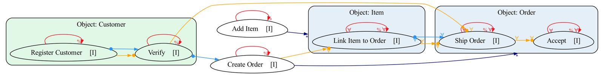

# Object Centric DCR Graph Discovery in OCPA

This library is an extension of the Python library OCPA (Object-Centric Process Analysis) and the result of a software lab at the Chair of Process and Data Science at RWTH Aachen University.
OCPA is enhanced with support for Object-Centric Dynamic Condition Response (OC-DCR) Graphs, as well as their discovery from Object-Centric Event Logs (OCEL) using an adapted version of the OCDisCoveR algorithm.

Dynamic Condition Response (DCR) Graphs are an innovative and increasingly prominent business process notation. By extending OCPA to support this notation, we enhance the range of modeling and discovery tools available in OCPA. Offering multiple process discovery notations and algorithms allows users to choose the most appropriate one for a given context, improving OCPA’s applicability across a variety of domains and use cases. The implementation includes the discovery of a declarative process model that captures object lifecycles, one-to-many and many-to-many synchronization constraints between object types.

## Documentation

See the [User Manual and Documentation (PDF)](Object_Centric_DCR_Graph_Discovery_in_OCPA___User_Manual_and_Documentation.pdf). It provides detailed implementation insights as well as how-to instructions.
